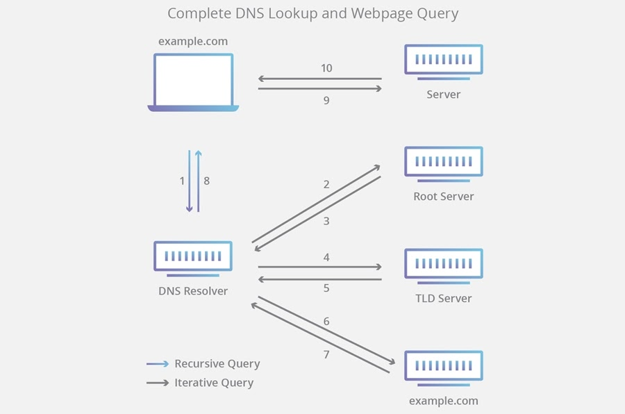

DNS (Domain Name System) adalah sistem yang bertindak sebagai "buku alamat" internet. Ia menghubungkan nama domain (seperti **google.com**) dengan alamat IP (seperti **142.250.190.46**) sehingga perangkat dapat saling berkomunikasi. Berikut penjelasan langkah-langkahnya:

### 1. **Pengguna Memasukkan Nama Domain**

- Ketika Anda mengetik nama domain di browser (misalnya, **google.com**), komputer tidak memahami nama tersebut. Ia hanya memahami alamat IP.

---

### 2. **Resolusi DNS Dimulai**

- Browser menghubungi **resolver DNS lokal**, biasanya server DNS yang disediakan oleh penyedia internet (ISP).

---

### 3. **Resolver Memeriksa Cache**

- Resolver DNS memeriksa apakah sudah ada jawaban (alamat IP) untuk domain tersebut di cache-nya.
    - Jika ada, ia mengembalikan alamat IP ke browser.
    - Jika tidak ada, ia melanjutkan proses.

---

### 4. **Query ke Root Server**

- Resolver mengirim permintaan ke **Root DNS Server**.
    - Root server tidak tahu alamat IP spesifik, tetapi ia memberikan petunjuk ke server berikutnya: **Top-Level Domain (TLD) DNS server**.

---

### 5. **Query ke TLD Server**

- Resolver kemudian menghubungi server TLD (misalnya, **.com**, **.org**).
    - TLD server mengarahkan resolver ke **Authoritative DNS Server** untuk domain yang diminta.

---

### 6. **Query ke Authoritative DNS Server**

- Authoritative DNS Server adalah tempat data domain disimpan.
- Server ini memberikan alamat IP spesifik untuk domain (misalnya, **google.com -> 142.250.190.46**).

---

### 7. **Alamat IP Dikirim ke Resolver**

- Resolver menerima alamat IP dari Authoritative DNS Server dan menyimpannya dalam cache untuk digunakan di masa depan.

---

### 8. **Browser Menghubungi Alamat IP**

- Dengan alamat IP, browser dapat mengirimkan permintaan ke server web yang terkait.
- Server mengembalikan konten (seperti halaman HTML) ke browser untuk ditampilkan kepada pengguna.

---

### Ilustrasi Proses

Misalnya, Anda ingin membuka **[www.example.com](http://www.example.com/)**:

1. Anda mengetik **[www.example.com](http://www.example.com/)** di browser.
2. Resolver DNS mencari informasi dan bertanya ke:
    - **Root Server**: "Siapa yang bertanggung jawab untuk .com?"
    - **TLD Server**: "Siapa yang bertanggung jawab untuk example.com?"
    - **Authoritative DNS Server**: "Berikan saya IP untuk [www.example.com](http://www.example.com/)."
3. Resolver mendapatkan IP, seperti **93.184.216.34**.
4. Browser mengakses **93.184.216.34** untuk memuat situs.

### Mengapa DNS Penting?

1. **Mempermudah Pengguna**: Kita tidak perlu mengingat alamat IP.
2. **Skalabilitas**: DNS memungkinkan miliaran domain dan pengguna.
3. **Redundansi**: Sistem DNS terdistribusi untuk memastikan keandalan.

Dengan ini, DNS membantu mengubah nama domain yang mudah diingat menjadi alamat IP yang dimengerti oleh komputer.