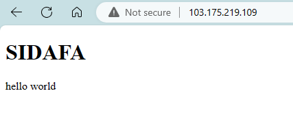

# Install NGINX with Docker

## Studi Kasus
- saya memiliki folder `/home/sammy/ftp/files`
- folder ini terhubung dengan konfigurasi FTP
- saya ingin folder ini terhubung ke NGINX Docker agar bisa public

## create nginx.conf in folder `/home/sammy/ftp/files`
Buat berkas dengan nama nginx.conf di dalam folder /home/sammy/ftp/files dengan konten berikut:
```
server {
    listen 80;
    server_name localhost;

    location / {
        root /usr/share/nginx/html;
        index index.html;
    }
}
```
## Membuat Container Docker Nginx
```
docker run -d --name nginx-container -v /home/sammy/ftp/files:/usr/share/nginx/html -v /home/sammy/ftp/files/nginx.conf:/etc/nginx/conf.d/default.conf -p 80:80 nginx
```
## Ubah hak akses folder pada host
```
sudo chmod -R 755 /home/sammy/ftp/files
```

## Periksa Hak Akses Nginx di Dalam Container
```
docker exec -it nginx-1 /bin/bash
```
```
ls -l /usr/share/nginx
```

## restart docker 
```
docker restart nginx-1
```

## Optional
cek status nginx
```
nginx -t
```
---
<br>
<br>


# Instalasi docker Nginx menggunakan docker compose
studi kasus: saya ingin menginstall Nginx menggunakan docker compose, agar jika ada pembaharuan seperti subdomain, saya bisa mengupdatenya tanpa harus menghapus container. Hal ini tidak bisa dilakukan menggunakan Docker command, oleh karena itu, saya menggunakan docker compose.

## buat file `default.conf`
```
root@vps-sidafa:/home/sidafa/docker# mkdir nginx
root@vps-sidafa:/home/sidafa/docker# cd nginx
root@vps-sidafa:/home/sidafa/docker/nginx# mkdir conf.d
root@vps-sidafa:/home/sidafa/docker/nginx# cd conf.d
root@vps-sidafa:/home/sidafa/docker/nginx/conf.d# nano default.conf
```
isi `default.conf` sebagai berikut
```
server {
    listen 80;
    server_name 103.175.219.109;

    location / {
        root /usr/share/nginx/html;
        index index.html;
    }
}
```
simpan dan keluar `ctrl+x`->`y`->`enter`.

## buat file docker-compose.yml
```
root@vps-sidafa:/home/sidafa/docker/nginx/conf.d# cd ..
root@vps-sidafa:/home/sidafa/docker/nginx# ls
conf.d 
root@vps-sidafa:/home/sidafa/docker/nginx# nano docker-compose.yml
```
isi file `docker-compose.yml`
```
version: "3"

services:
  nginx:
    container_name: nginx
    image: nginx
    volumes:
      - /var/www/html:/usr/share/nginx/html
      - /home/sidafa/docker/nginx/conf.d:/etc/nginx/conf.d
    ports:
      - "80:80"
      - "443:443"
    command: /bin/bash -c "cp /etc/nginx/conf.d/default.conf /etc/nginx/conf.d/default.conf.backup && nginx -g 'daemon off;'"
```
> sesuaikan nama user anda, disini saya menggunakan user dengan nama `sidafa`

simpan dan keluar `ctrl+x`->`y`->`enter`.
```
root@vps-sidafa:/home/sidafa/docker/nginx# docker-compose up -d
```

## buat file index.html
```
root@vps-sidafa:/home/sidafa/docker/nginx# nano /var/www/html/index.html
```
```
<!DOCTYPE html>
<html>
<head>
<title>Page Title</title>
</head>
<body>

<h1>SIDAFA</h1>
<p>hello world</p>

</body>
</html>
```

## buka port pada firewall
```
ufw allow 80
ufw allow 443
```

## selesai


# redirect domain to ip:port
```
users@sidafa909:/home/sidafa909/docker/nginx/conf.d# cat default.conf
server {
    listen 80;
    server_name 103.175.217.87;

    root /usr/share/nginx/html;
    index index.php index.html index.htm;

}

server {
    listen 80;
    server_name sub.domain.com;

    location / {
        proxy_pass http://103.175.217.87:8001/;
        proxy_set_header Host $host;
        proxy_set_header X-Real-IP $remote_addr;
        proxy_set_header X-Forwarded-For $proxy_add_x_forwarded_for;
        proxy_set_header X-Forwarded-Proto $scheme;
    }
}

```